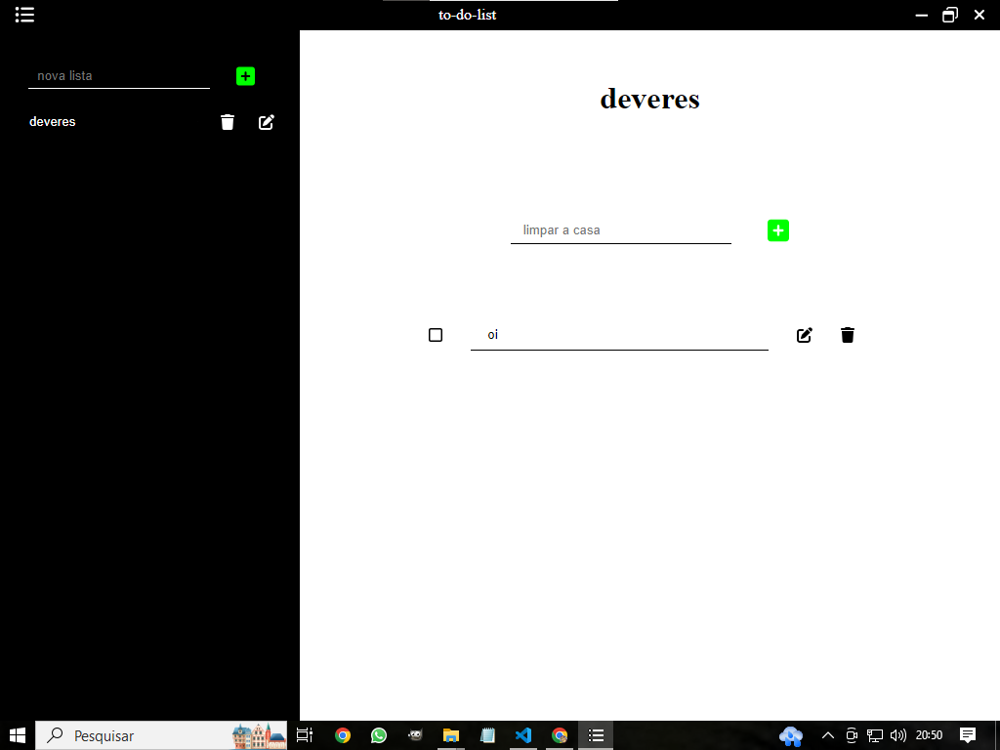

  

# To-do-list

  Esse é um projeto **full-stack**, que usa umaAPI rest para amazenar os dados.

## Comandos

* **npm start:** **Inicia** o projeto sem instala-lo.
* **npm run build:** Cria uma pasta, chamada build, com um **executável(.exe)** do projeto.

## Observações

* **Mover o executável:** se quiser mover o executável para outro lugar, crie um atalho. Você pode fazer isso apertando no **botão direito** do mouse no executável e depois no "**Criar atalho**".
* **Sistemas operacionais:** ele foi criado para windows 10 x64bits, ele **talvez funcione** no **linux** e no **mac**.
* **Demora ao iniciar**: o executavel pode demorar um pouco ao iniciar, pois ele iniciar um **servidor backend** e depois inicia o frontend.
